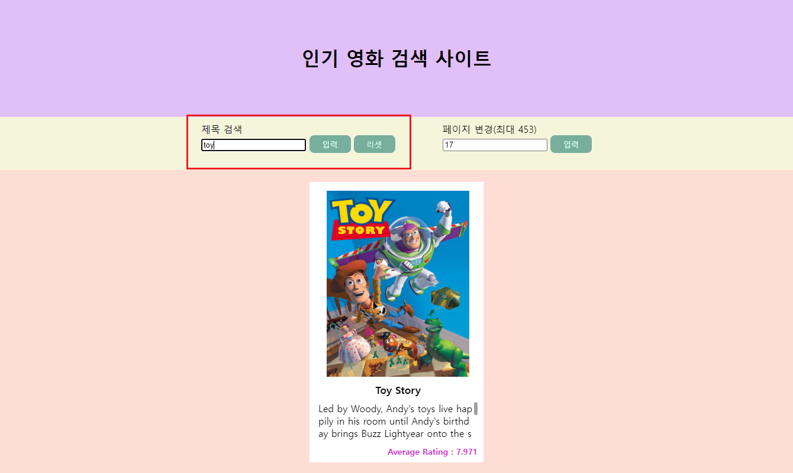

# 사용법

- 배포 주소 : https://picoloman6.github.io/nbc_week2/
- 로컬 : .env, .env.default로 tmdb api 생성 -> yarn build -> deploy/index.html

# 기술스택

- JavaScript
- dotenv
- Webpack
- Babel

# 스크린샷

### 메인화면

- https://www.themoviedb.org/ 에서 제공하는 인기 영화 API 활용

### 페이지 변경

- 직접 입력으로 페이지 변경

### 페이지 내 검색

### 상세정보 모달

### 텍스트 슬라이드 애니메이션 적용

### 유효성 검사

# 기술적 도전

### dotenv 적용

### 웹팩 및 바벨 적용

### 모달 코드 스플리팅 적용

- webpack을 활용한 dynamic import

### Github Pages를 활용한 배포

- 기본 배포용 yml 파일 수정 해 runner 환경에서 webpack 번들링 진행

# 최종 디렉토리 구조

